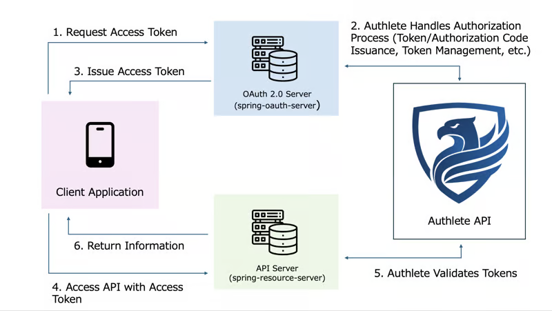
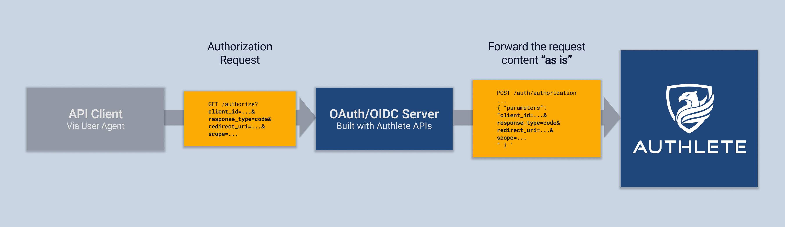
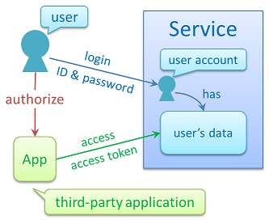

# OAuth2AuthleteServer

`Authorization Endpoint `: /api/authorization 

`Token Endpoint` : /api/token

`JWK Set Endpoint` : /api/jwks

`Discovery Endpoint` : /.well-known/openid-configuration

`Revocation Endpoint` : /api/revocation

`Introspection Endpoint` : /api/introspection

`Registration Endpoint` : /api/register

`Pushed Authorization Request Endpoint` : /api/par

`Grant Management Endpoint` : /api/gm/{grantId}

`Federation Configuration Endpoint` : /.well-known/openid-federation

`Federation Registration Endpoint` : /api/federation/register

`Credential Issuer Metadata Endpoint` : /.well-known/openid-credential-issuer


`JWT Issuer Metadata Endpoint` : /.well-known/jwt-issuer

`JWT VC Issuer Metadata Endpoint` : /.well-known/jwt-vc-issuer


```scala


case class Consent(
  consentId: String,
  permissions: Array[String],
  status: String,
  creationDateTime: String,
  expirationDateTime: String,
  statusUpdateDateTime: String,
  clientId: Long,
  refreshToken: String
)


case class AccountData(
  brandName: String,
  companyCnpj: String,
  `type`: String,
  compeCode: String,
  branchCode: String,
  number: String,
  checkDigit: String,
  accountId: String
)
```




[build-oauth-20-server-api-server-with-authlete-spring-boot](https://dev.to/authlete/build-oauth-20-server-api-server-with-authlete-spring-boot-5aj4)


This authorization server implementation uses `Authlete` as its backend. What this means are:
 1. that the core part of the implementation of OAuth 2.0 and OpenID Connect is not in the source tree of spring-oauth-server but in the Authlete server on cloud, and 
 2. that authorization data such as access tokens, settings of the authorization server itself and settings of client applications are not stored in any local database but in the database on cloud. Therefore, to put it very simply, this implementation is just an intermediary between client applications and Authlete server as illustrated below.

```sh
+--------+          +---------------------+            +----------+
|        |          |                     |            |          |
| Client | <------> |oauth2-authlete-server | <------> | Authlete |
|        |          |                     |            |          |
+--------+          +---------------------+            +----------+
```

However, because Authlete focuses on authorization and does NOT do anything about end-user authentication, functions related to authentication are implemented in this application

Authlete provides Web APIs that can be used to write an authorization server. `authlete-java-common` is a library which directly communicates with the Web APIs


## Authorization Decision Endpoint
In an authorization page, an end-user decides either to grant permissions to the client application which made the authorization request or to deny the authorization request. An authorization server must be able to receive the decision and return a proper response to the client application according to the decision.

The current implementation of oauh2-authlete-server receives the end-user's decision at 
`/api/authorization/decision`

Authorization Decision Endpoint
An authorization page displays information about an authorization request such as the name of the client application and requested permissions. An end-user checks the information and decides either to authorize or to deny the request. An authorization server receives the decision and returns a response according to the decision. Therefore, an authorization server must have an endpoint that receives the decision by an end-user in addition to the authorization endpoint.

## API Version:

- AuthleteApiImpl is designed for Authlete 2.x API.
- AuthleteApiImplV3 is designed to support Authlete API V3.

## Path Constants:

- AuthleteApiImpl uses paths like "/api/auth/authorization".
- AuthleteApiImplV3 uses paths with service ID placeholders like "/api/%d/auth/authorization"

## Credential Handling:

- AuthleteApiImpl uses mServiceOwnerAuth and mServiceAuth for different authorization contexts.
- AuthleteApiImplV3 uses mAuth and mServiceId for authorization.

# Dpop

DPoP Header: This is an HTTP header that contains a signed JWT (JSON Web Token) used to demonstrate proof-of-possession of the private key associated with the DPoP access token. It includes claims such as the HTTP method (htm), the HTTP URI (htu), and a unique JWT ID (jti). This header is sent with every request to a protected resource to prove that the requestor possesses the private key associated with the DPoP access token.

DPoP Access Token: This is an access token that is bound to a specific client by a cryptographic key. It is issued by the authorization server and includes a confirmation claim that binds it to the client's key. The DPoP access token ensures that only the legitimate client (that possesses the private key) can use the token.

[oauth](https://www.authlete.com/developers/tutorial/oauth/)


[oidc](https://www.authlete.com/developers/tutorial/oidc/)

[getting_started_java](https://www.authlete.com/developers/tutorial/getting_started_java/)

[tutorial/fapi](https://www.authlete.com/developers/tutorial/fapi/)

[fapi_with_ref_impl](https://www.authlete.com/developers/tutorial/fapi_with_ref_impl/)


[financial_grade_apigateway](https://www.authlete.com/developers/tutorial/financial_grade_apigateway/)

[Integration with External IdPs](https://www.authlete.com/developers/tutorial/idp/)

[Amazon Cognito and Latest OAuth/OIDC Specifications](https://www.authlete.com/developers/tutorial/cognito/)



we need to figure out who you are to be able to know what rights you have

```scala

object AuthServiceImpl:
  def make[F[_]](
    usersService: UsersService[F],
    encryptionService: EncryptionService[F],
    tokensService: TokensService[F],
    expiresIn: TokenExpiration
  )(using S: Sync[F]): AuthService[F] =
    new AuthService[F]

```


Unlike `ES256`, which specifies a signing algorithm, `EC256` is broader and can be used for:
- `Key Exchange`: Generating keys for secure communication.
- `Encryption`: Using elliptic curve-based algorithms for encrypting data.
- `Signatures`: Signing data using elliptic curve-based algorithms like ECDSA


As an authorization standard, OAuth does not directly manage authentication directly, but it can give already authenticated users access to appropriate resources


A client application accesses a protected resource endpoint with an access token which has been issued from either the authorization endpoint or the token endpoint. The protected resource endpoint implementation must verify that the access token has the correct privileges to access the protected resource before acting on the request.


Authlete provides an introspection API to retrieve information about an access token. Implementations of protected resource endpoints use this API to determine the end user and permissions associated with the token and allow or deny the request accordingly.


Web APIs protected by OAuth 2.0 access tokens are called protected resource endpoints. Such endpoints do the following before they return requested data to client applications.

1. Extract an access token from a request.
2. Get detailed information about the access token from the authorization server.
3. Validate the access token.

The next step after getting detailed information about an access token is to validate the access token. Validation involves the following steps.

- Has it expired or not?
- Has it been revoked or not?
- Does it cover necessary permissions?
- Is it associated with the expected end-user?
As mentioned, you can delegate validation to Authlete’s introspection API if you want. scopes and subject are optional parameters for the introspection API to specify the scopes (= permissions) that your protected resource endpoint requires and the subject (= unique identifier) of an end-user that your protected resource endpoint expects.

If you utilize scopes parameter and subject parameter accordingly based on your needs, you don’t have to write separate validation code.


API driven development, api security


[protected_resource](https://www.authlete.com/developers/definitive_guide/protected_resource/)


[authorization_endpoint_imp](https://www.authlete.com/developers/definitive_guide/authorization_endpoint_impl/)


```ts
/**
 * A regular expression for extracting "DPoP {access_token}" in the
 * `Authorization` request header.
 */
const DPOP_PATTERN = /"^DPoP\s*([^\s]+)\s*$/i;


/**
 * A regular expression for extracting "Bearer {access_token}" in the
 * `Authorization` request header.
 */
const BEARER_PATTERN = /^Bearer\s*([^\s]+)\s*$/i;

```

  "Scope" is a technical term in the context of OAuth 2.0. It represents
  a permission which is necessary to access protected resources.

 When a client application asks an authorization server to issue an access token, the client application includes a list of scopes in the request. If the specified scopes are supported by the server, the server issues an access token that has the scopes.
 
 If unsupported scopes are included in a request, the server ignores such scopes. As a result, the access token which will be issued based on the request will include supported scopes only. For example, if a request including `scope1` and `scope2` is sent to a server that supports `scope1` only, the issued access token will include `scope1` only

 If a server supports [OpenID Connect
 Discovery 1.0](https://openid.net/specs/openid-connect-discovery-1_0.html) or 
 [[RFC 8414] OAuth 2.0 Authorization Server Metadata](https://www.rfc-editor.org/rfc/rfc8414.html), it is highly likely that the discovery document advertised by the server includes the
  `scopes_supported` server metadata which is a list of scopes supported by the server


  [full-scratch-implementor-of-oauth-and-openid-connect-talks-about-findings](https://darutk.medium.com/full-scratch-implementor-of-oauth-and-openid-connect-talks-about-findings-55015f36d1c3)

  ```sh
  On the other hand, authorization is complicated because three elements, namely, “who”, “what permissions” and “to whom”, are involved. In addition, what makes it confusing is that among the three elements, the process to identify “who” is authentication. In other words, the fact that authorization process includes authentication process as a part is making things confusing.
 ```

 Because authorization process includes authentication process as a part, being authorized means being authenticated

 `(Identity, Authentication) + OAuth 2.0 = OpenID Connect`

 Thanks to this, authentication by OpenID Connect can be executed at the same time during the authorization process by OAuth.


 ```sh
 Regarding entropy for symmetric signature and encryption algorithms, 16.19 Symmetric Key Entropy in OpenID Connect Core 1.0 states as follows.

In Section 10.1 and Section 10.2, keys are derived from the client_secret value. Thus, when used with symmetric signing or encryption operations, client_secret values MUST contain sufficient entropy to generate cryptographically strong keys. Also, client_secret values MUST also contain at least the minimum of number of octets required for MAC keys for the particular algorithm used. So for instance, for HS256, the client_secret value MUST contain at least 32 octets (and almost certainly SHOULD contain more, since client_secret values are likely to use a restricted alphabet).
``` 

Authentication deals information about "who one is". Authorization deals information about "who grants what permissions to whom". Authorization flow contains authentication as its first step. It is the reason people are often confused.


OAuth 2.0 is a framework where a user of a service can allow a third-party application to access his/her data hosted in the service without revealing his/her credentials (ID & password) to the application





OpenID Connect is a framework on top of OAuth 2.0 where a third-party application can obtain a user's identity information which is managed by a service.


OAuth is a specification for authorization
OAuth 2.0 is a specification for authorization, but NOT for authentication. RFC 6749, 3.1. Authorization Endpoint explicitly says as follows:

The authorization endpoint is used to interact with the resource owner and obtain an authorization grant. The authorization server MUST first verify the identity of the resource owner. The way in which the authorization server authenticates the resource owner (e.g., username and password login, session cookies) is beyond the scope of this specification.


OAuth authentication?
Authentication deals information about "who one is". Authorization deals information about "who grants what permissions to whom". Authorization flow contains authentication as its first step. It is the reason people are often confused.

There are many libraries and services that use OAuth 2.0 for authentication. It is often called "social login" and It makes people more confused. If you see "OAuth authentication" (not "OAuth authorization"), it is a solution using OAuth for authentication.


OpenID Connect
OpenID 1.0 and OpenID 2.0 are old specifications for authentication. Those who made the specifications expected people to use OpenID for authentication. However, some people began to use OAuth 2.0 for authentication (not for authorization) and OAuth authentication has prevailed rapidly.

From a viewpoint of OpenID guys, authentication based on OAuth was not secure enough, but they had to admit that people preferred OAuth authentication. As a result, OpenID guys decided to define a new specification, OpenID Connect, on top of OAuth 2.0.

Yes, this has made people much more confused.


One-sentence definitions of OAuth 2.0 and OpenID Connect
OAuth 2.0 is a framework where a user of a service can allow a third-party application to access his/her data hosted in the service without revealing his/her credentials (ID & password) to the application.

enter image description here

OpenID Connect is a framework on top of OAuth 2.0 where a third-party application can obtain a user's identity information which is managed by a service.

enter image description here

(Sorry, these definitions are excerpts from the overview page of my company)


### Definitions from a viewpoint of implementors
Authentication is a process to determine the subject (= unique identifier) of an end-user. There are many ways to determine the subject. ID & password, fingerprints, iris recognition, etc.

Authorization is a process to associate the subject with the requested permissions and the client application that requested the permissions. An access token represents the association.


[OAuth 2.0 Step-up Authentication Challenge Protocol](https://darutk.medium.com/stepup-authn-ef5ac37b18e2)


## Authentication Context Class Reference (ACR)
User authentication is performed somewhere during an authorization flow. OAuth 2.0 and OpenID Connect do not define details about how to authenticate users, but client applications can specify criteria of user authentication by including a list of ACRs in an authorization request.

The authorization server tries to perform user authentication that satisfies at least one of the specified ACRs. However, no error is reported even if the authorization server cannot perform such user authentication unless the acr claim is requested as “essential”


Hash functions ensure:
- Integrity: Even a tiny change in the message results in a completely different hash.
- Fixed Output: The hash size is constant regardless of message size.


 encrypted hash = digital signature

 - Hashing reduces the message size to a small, fixed-size digest.
- Encrypting a hash (small) is faster than encrypting the entire message (large).


SPI (Service Provider Interface)
SPI refers to a design pattern where an interface allows third parties (service providers) to plug in their own implementations.

Service
A well-known set of programming interfaces and classes that provide access to some specific application functionality or feature.


`token type`              `Audience`
- access token               Resource url
- refresh token              token endpoint
- Authorization code         token endpoint
- id token                   client    

OAuth is about client authorization and not user authorization

Authenticated hashing
HashMessage authentication codes
hmac= hash + cryptographic key


This implementation is an intermediary between client applications and the authelete server

Authlete provides Web APIs that can be used to write an authorization server. `authlete-java-common` is a library which directly communicates with the Web APIs, and `authlete-java-jaxrs` is a library which provides utility classes wrapping the `authlete-java-common` API to make it much easier for developers to implement an authorization server than using `authlete-java-common` API directly. `java-oauth-server` is written using `authlete-java-jaxrs` API exposed by the utility classes.

```sh

+-------------------------------+
|          java-oauth-server    |
+----+--------------------------+
|    |     authlete-java-jaxrs  |
|    +---+----------------------+          +----------+
| JAX-RS | authlete-java-common | <------> | Authlete |
+--------+----------------------+          +----------+

```
Common practice to do authenticated hash after encyrpting with AWS-CBC

AES-GCM Mode produces the hash as it encrypts

- nonce- 12 bytes(96 bits)
- keysize =128,192 or 256 bit
- Associated Data= Any metadata to be included

digital signature consists of 3 algorithms
- calculate the signature of a hash of your data
- sign the hash of the original data


[pkce-vs-nonce-equivalent-or-not](https://danielfett.de/2020/05/16/pkce-vs-nonce-equivalent-or-not/)

Traditionally, the `state` parameter is used to provide protection against Cross-Site Request Forgery (CSRF) attacks on OAuth. The newer mechanisms `PKCE (RFC7636)` and the `OpenID Connect` parameter `nonce` not only protect against CSRF, but they also provide some level of protection against Code Injection attacks.


## PKCE
PKCE is defined in RFC7636. Here, I only consider the SHA256 code challenge method, which works as follows: The client selects a fresh random number (nonce). It hashes the nonce and sends it in the `code_challenge` parameter to the authorization server. In the token request, the client sends the original nonce in the `code_verifier` parameter. The authorization server compares the `hash` of the `code_verified` to the `code_challenge` and responds with the access token iff and only if they match.


[identity-vs-permissions](https://leastprivilege.com/2016/12/16/identity-vs-permissions/)