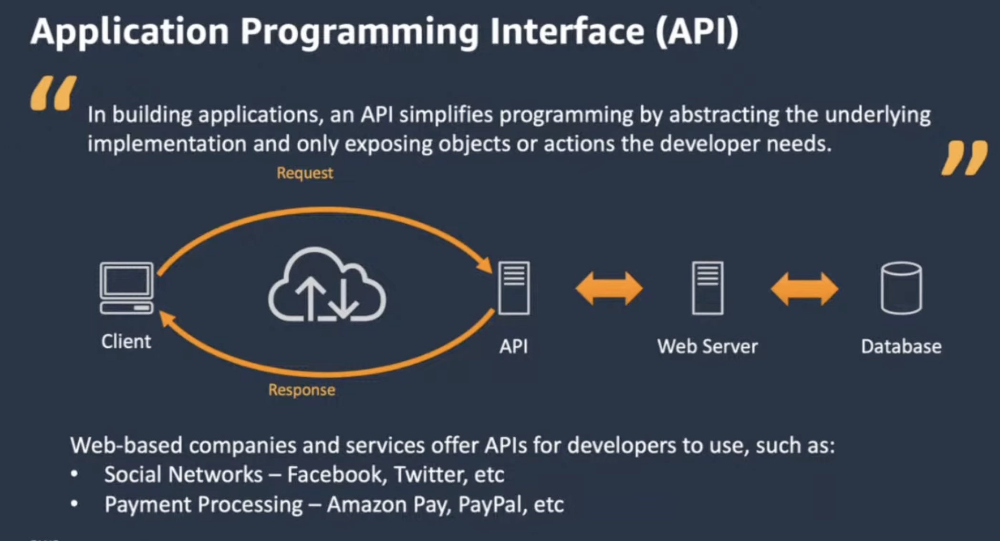
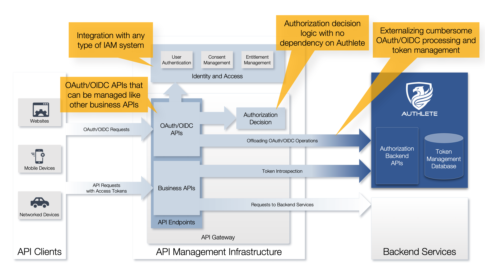

# API

APIs abstract service implementations

APIs enable cross-platform functionality, allowing web, mobile, and desktop applications to access the same backend services

What is an API?
APIs are mechanisms that enable two software components to communicate with each other using a set of definitions and protocols. For example, the weather bureau’s software system contains daily weather data. The weather app on your phone “talks” to this system via APIs and shows you daily weather updates on your phone.

Interface can be thought of as a contract of service between two applications. This contract defines how the two communicate with each other using requests and responses. Their API documentation contains information on how developers are to structure those requests and responses.

There are four different ways that APIs can work depending on when and why they were created.

- SOAP APIs 
These APIs use Simple Object Access Protocol. Client and server exchange messages using XML. This is a less flexible API that was more popular in the past.

- RPC APIs
These APIs are called Remote Procedure Calls. The client completes a function (or procedure) on the server, and the server sends the output back to the client.

- Websocket APIs
Websocket API is another modern web API development that uses JSON objects to pass data. A WebSocket API supports two-way communication between client apps and the server. The server can send callback messages to connected clients, making it more efficient than REST API.

- REST APIs
These are the most popular and flexible APIs found on the web today. The client sends requests to the server as data. The server uses this client input to start internal functions and returns output data back to the client. 

## What is web API?
A Web API or Web Service API is an application processing interface between a web server and web browser. All web services are APIs but not all APIs are web services. REST API is a special type of Web API that uses the standard architectural style explained above.

What is an API endpoint and why is it important?
API endpoints are the final touchpoints in the API communication system. These include server URLs, services, and other specific digital locations from where information is sent and received between systems. API endpoints are critical to enterprises for two main reasons: 

1. Security
API endpoints make the system vulnerable to attack. API monitoring is crucial for preventing misuse.

2. Performance
API endpoints, especially high traffic ones, can cause bottlenecks and affect system performance.

## What is an API gateway?
An API Gateway is an API management tool for enterprise clients that use a broad range of back-end services. API gateways typically handle common tasks like user authentication, statistics, and rate management that are applicable across all API calls.

Amazon API Gateway is a fully managed service that makes it easy for developers to create, publish, maintain, monitor, and secure APIs at any scale. It handles all the tasks involved in accepting and processing thousands of concurrent API calls, including traffic management, CORS support, authorization, and access control, throttling, monitoring, and API version management.

## Parameters

RESTful API requests can include parameters that give the server more details about what needs to be done. The following are some different types of parameters:

- Path parameters that specify URL details.
- Query parameters that request more information about the resource.
- Cookie parameters that authenticate clients quickly.

2XX codes indicate success, but 4XX and 5XX codes indicate errors. 3XX codes indicate URL redirection.

- 200: Generic success response
- 201: POST method success response

`Identity is a set of attributes related to an entity..`

Entity-identity model

entity can be a user, machine,service

we want to express ourselves depending on who we are talking to by controlling the set  attributes- identities we show. So your identity to your friend is not the same as your identity to your boss

we have multiple identities

you want to use different identities on sites to get better service

identity layer provides:
- who is the user that got authenticated
- where was he authenticated
- when was he authenticated
- how was he authenticated
- what attributes he can give you
- why he is providing them

authorization code and refresh token are sender constrained

api first design,api security

kill all sbt processes `pkill -f sbt`

IAM identity and access management
- identity maanagement
- access management

`Transfer-Encoding: chunked header, the chunking is preserved`

Controolling  and managing access to http APIS(AWS)
- JWT Authorizer
- Lambda Authorizer
- I AM Authorization
- mTLS Authentication

The solution conforms to FAPI *1 and CIBA *2, which are open standards in financial-grade API security

### (1) FAPI (Financial-grade API)

FAPI is a set of security profiles that aim to prevent unauthorized API access e.g., fraudulent acquisition and use of access tokens, by extending OAuth/OIDC. It is expected to be adopted by industries such as financials, where higher security measures are required. Banks can take advantage of the standard to provide open APIs to third parties like Fintechs in a secure manner.

### (2) CIBA (Client Initiated Backchannel Authentication)

CIBA is a new user authentication and API authorization flow in addition to existing OAuth/OIDC ones. A device initiating the flow and another one used for user authentication and authorization are separated so that customer-centric APIs can be applicable for broad use cases from smart appliances, call centers, to user authentication using smartphones. In financial services industry, the specification is expected to extend applications of open APIs.

