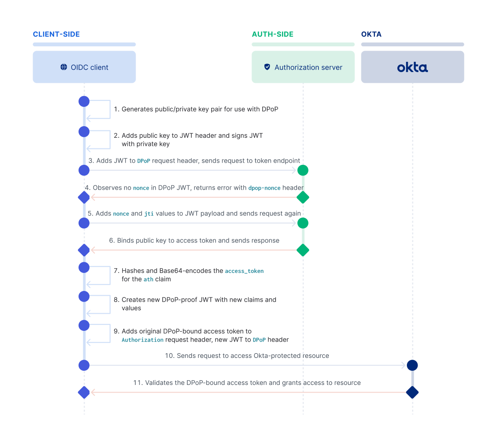

# DPop
- Dpop binds tokens to the client that requested it
   1. Sender constrained token
   2. DPop is one of two methods for this purpose in FAPI 2.0 security profile

- DPop-proofs are represented as JSON Web Tokens(jwt)
- DPop support can eb added to an authorization server without breaking existing replying parties
- Dpop can be added to replying parties with relatively small effort

purpose: `protect authorization code, access token, refresh token against misuse`


cookies are also bearer tokens


fapi 2 combines oauth 2.1 and dpop or mtls


# Introduction {#Introduction}

DPoP (for Demonstrating Proof-of-Possession at the Application Layer)
is an application-level mechanism for
sender-constraining OAuth [@!RFC6749] access and refresh tokens. It enables a client to
prove the possession of a public/private key pair by including 
a `DPoP` header in an HTTP request. The value of the header is a JSON Web Token
(JWT) [@!RFC7519] that enables the authorization
server to bind issued tokens to the public part of a client's 
key pair. Recipients of such tokens are then able to verify the binding of the
token to the key pair that the client has demonstrated that it holds via
the `DPoP` header, thereby providing some assurance that the client presenting
the token also possesses the private key.
In other words, the legitimate presenter of the token is constrained to be
the sender that holds and can prove possession of the private part of the
key pair.

DPoP can be used to sender-constrain access tokens regardless of the 
client authentication method employed, but DPoP itself is not used for client authentication.
DPoP can also be used to sender-constrain refresh tokens issued to public clients 
(those without authentication credentials associated with the `client_id`).


# Objectives {#objective}

The primary aim of DPoP is to prevent unauthorized or illegitimate 
parties from using leaked or stolen access tokens, by binding a token
to a public key upon issuance and requiring that the client proves
possession of the corresponding private key when using the token. 
This constrains the legitimate sender of the token to only the party with
access to the private key and gives the server receiving the token added 
assurances that the sender is legitimately authorized to use it.  

Access tokens that are sender-constrained via DPoP thus stand in 
contrast to the typical bearer token, which can be used by any party in
possession of such a token


!---
~~~ ascii-art
+--------+                                          +---------------+
|        |--(A)-- Token Request ------------------->|               |
| Client |        (DPoP Proof)                      | Authorization |
|        |                                          |     Server    |
|        |<-(B)-- DPoP-bound Access Token ----------|               |
|        |        (token_type=DPoP)                 +---------------+
|        |
|        | 
|        |                                          +---------------+
|        |--(C)-- DPoP-bound Access Token --------->|               |
|        |        (DPoP Proof)                      |    Resource   |
|        |                                          |     Server    |
|        |<-(D)-- Protected Resource ---------------|               |
|        |                                          +---------------+
+--------+
~~~
!---
Figure: Basic DPoP Flow {#basic-flow}


The basic steps of an OAuth flow with DPoP (without the optional nonce) are shown in (#basic-flow):

  * (A) In the Token Request, the client sends an authorization grant 
    (e.g., an authorization code, refresh token, etc.)  
    to the authorization server in order to obtain an access token
    (and potentially a refresh token). The client attaches a DPoP
    proof to the request in an HTTP header.
  * (B) The authorization server binds (sender-constrains) the access token to the
    public key claimed by the client in the DPoP proof; that is, the access token cannot
    be used without proving possession of the respective private key.
    If a refresh token is issued to a public client, it too is
    bound to the public key of the DPoP proof. 
  * (C) To use the access token, the client has to prove
    possession of the private key by, again, adding a header to the
    request that carries a DPoP proof for that request. The resource server needs to
    receive information about the public key to which the access token is bound. This
    information may be encoded directly into the access token (for
    JWT structured access tokens) or provided via token
    introspection endpoint (not shown). 
    The resource server verifies that the public key to which the
    access token is bound matches the public key of the DPoP proof.
    It also verifies that the access token hash in the DPoP proof matches the
    access token presented in the request.
  * (D) The resource server refuses to serve the request if the
    signature check fails or the data in the DPoP proof is wrong,
    e.g., the target URI does not match the URI claim in the DPoP
    proof JWT. The access token itself, of course, must also be 
    valid in all other respects. 


Implements the DPoP HTTP header as in https://datatracker.ietf.org/doc/html/rfc9449.

Like PKCE, DPoP allows a HTTP server to authenticate a HTTP client as the same client of some previous request.
However, being based on asymmetric signature schemes it can be used across more than two HTTP requests,
unlike PKCE, and additionally it can also sign other things such as (access) tokens.

A DPoP is a JWT which (1) includes the public key with which it can be verified, and (2) signs the URL and HTTP
method of the HTTP request being done. In a second HTTP request, the HTTP server can authenticate the request
by matching the public key against that of the DPoP JWT from some earlier request, and verifying the signature.

 HTTP endpoints that require some token (e.g. an (access) token as in OpenID/OAuth) may additionally require this
 token to be signed in a DPoP JWT, to prevent replay attacks. If so, then:
- the token itself must be sent as a HTTP header as follows:

```sh
Authorization: DPoP $token
```
- The DPoP JWT must include the `ath` field in its body, which must be equal to the URL-safe-no-pad base64 encoding
of the SHA256 of the token.


Example DPoP JWT header and body:
```json
{
"typ": "dpop+jwt",
"alg": "ES256",
"jwk": {
 "kty": "EC",
"crv": "P-256"
"x": "l8tFrhx-34tV3hRICRDY9zCkDlpBhF42UQUfWVAWBFs",
"y": "9VE4jf_Ok_o64zbTTlcuNJajHmt6v9TDVrU0CdvGRDA",
}
}

{
"jti": "-BwC3ESc6acc2lTc",
"htm": "POST",
"htu": "https://server.example.com/token",
"iat": 1562262616
}
```


The proof contains metadata proving the sender and ways to limit unauthorized use by limiting the HTTP request, the validity window, and reuse. If you inspect a decoded DPoP proof JWT, you'll see the header contains information proving the sender:
 * The `typ` claim set to `dpop+jwt`
 * The public/private key encryption algorithm
 * The public key in [JSON Web Key (JWK)](https://www.rfc-editor.org/rfc/rfc7517) format


 Inspecting the decoded proof's payload shows claims that limit unauthorized use, such as:
 * HTTP request info including the URI and HTTP method (such as `https://{yourOktaDomain}/oauth2/v1/token` and `POST`)
 * Issue time to limit the validity window for the proof
 * An identifier that's unique within the validity window to mitigate replay attacks


 ```http
POST https://{yourOktaDomain}/oauth2/v1/token HTTP/1.1
DPoP: eyJ0eXAiOiJkcG9w.....H8-u9gaK2-oIj8ipg
Accept: application/json
Content-Type: application/x-www-form-urlencoded

grant_type=authorization_code
code=XGa_U6toXP0Rvc.....SnHO6bxX0ikK1ss-nA
```


The authorization server decodes the proof and incorporates properties from the JWT into the access token. The authorization server responds to the `/token` request with the token and explicitly sets the response header to state the token type as `DPoP`.

```http
HTTP/1.1 200 OK
Content-Type: application/json

{
"access_token":"eyJhbG1NiIsPOk.....6yJV_adQssw5c",
"token_type":"DPoP",
"expires_in":3600,
"refresh_token":"5PybPBQRBKy2cwbPtko0aqiX"
}
```

You now have a DPoP type access token with a possession proof. What changes when requesting resources?

## Use DPoP-bound access tokens in HTTP requests

DPoP tokens are no longer bearer tokens; the token is now "sender-constrained." The sender, the client application calling the resource server, must have both the access token and a valid proof, which requires the private key held by the client. This means malicious sorts need both pieces of information to impersonate calls into the server. The spec builds in constraints even if a malicious sort steals the token and the proof. The proof limits the call to a unique request for the URI and method within a validity window. Plus, your application system still has the defensive web security measures applicable to all web apps, preventing the leaking of sensitive data such as tokens and keysets. 

The client generates a new proof for each HTTP request and adds a new property, a hash of the access token. The hash further binds the proof to the access token itself, adding another layer of sender constraint. The proof's payload now includes:
 * HTTP request info including the URI and HTTP method (such as `https://{yourResourceServer}/resource` and `GET`)
 * Issue time to limit the validity window for the proof
 * An identifier that's unique within the validity window to mitigate replay attacks
 * Hash of the access token

Clients request resources by sending the access token in the `Authorization` header, along with proof demonstrating they're the legitimate holders of the access token to resource servers using a new scheme, `DPoP`. HTTP requests to the resource server change to

```http
GET https://{yourResourceServer}/resource HTTP/1.1
Accept: application/json
Authorization: DPop eyJhbG1NiIsPOk.....6yJV_adQssw5c
DPoP: eyJhbGciOiJIUzI1.....-DZQ1NI8V-OG4g
```

The resource server verifies the validity of the access token and the proof before responding with the requested resource. 


## Extend the DPoP flow with an enhanced security handshake

DPoP optionally defines an enhanced handshake mechanism for calls requiring extra security measures. The client _could_ sneakily create proofs for future use by setting the issued time in advance, but the authorization and resource servers can wield their weapon, the nonce. The nonce is an opaque value the server creates to limit the request's lifetime. If the client makes a high-security request, the authorization or resource server may issue a nonce that the client incorporates within the proof. Doing so binds the specific request and time of the request to the server.

An example of a highly secure request is when making the initial token request. Okta follows this pattern. Different industries may apply guidance and rules for the types of resource server requests requiring a nonce. Since the enhancement requires an extra HTTP request, use it minimally.

When the authorization server's `/token` request requires a nonce, the server rejects the request and returns an error. The response includes a new header type, `DPoP-Nonce`, with the nonce value, and a new standard error message, `use_dpop_nonce`. The flow for requesting tokens now looks like this:

 client redirects to authorization server for user challenge. The authorization server redirects back to the client with the authorization code. The client generates a public/private key and creates the proof. The client sends the proof in the token request. The authorization server rejects the request and returns a nonce. The client regenerates the proof with nonce incorporated and re-requests the tokens. The authorization server returns an access token bound to the proof.


Let's look at the HTTP response from the authorization and resource servers requiring a nonce. The authorization server responds to the initial token request with a `400 Bad Request` and the needed nonce and error information.

```http
HTTP/1.1 400 Bad Request
DPoP-Nonce: server-generated-nonce-value

{
  "error": "use_dpop_nonce",
  "error_description": "Authorization server requires nonce in DPoP proof"
}
```

When the resource server requires a nonce, the response changes. The resource server returns a `401 Unauthorized` with the `DPoP-Nonce` header and a `WWW-Authenticate` header containing the `use_dpop_nonce` error message.

```http
HTTP/1.1 401 Unauthorized
DPoP-Nonce: server-generated-nonce-value
WWW-Authenticate: error="use_dpop_nonce", error_description="Resource server requires nonce in DPoP proof"
```

We want that resource, so it's time for a new proof! The client reacts to the error and generates a new proof with the following info in the payload:
 * HTTP request info including the URI and HTTP method (such as `https://{yourResourceServer}/resource` and `GET`)
 * Issue time to limit the validity window for the proof
 * An identifier that's unique within the validity window to mitigate replay attacks
 * The server-provided nonce value
 * Hash of the access token

With this new proof, the client can remake the request.

## Validate DPoP requests in the resource server

Okta's API resources support DPoP-enabled requests. If you want to add DPoP support to your own resource server, you must validate the request. You'll decode the proof to verify the properties in the header and payload sections of the JWT. You'll also need to verify properties within the access token. OAuth 2.0 access tokens can be opaque, so use your authorization server's `/introspect` endpoint to get token properties. Okta's API security guide, [Configure OAuth 2.0 Demonstrating Proof-of-Possession](https://developer.okta.com/docs/guides/dpop/nonoktaresourceserver/main/#make-a-request-to-a-non-okta-resource) has a step-by-step guide on validating DPoP tokens, but you should use a well-maintained and vetted OAuth 2.0 library to do this for you instead. Finally, enforce any application-defined access control measures before returning a response.

## Learn more about OAuth 2.0, Demonstrating Proof-of-Possession, and secure token practices

I hope this intro to sender-constrained tokens is helpful and inspires you to use DPoP to elevate token security! Watch for more content about DPoP, including hands-on experimentation and code projects. If you found this post interesting, you may also like these resources:

* [Secure OAuth 2.0 Access Tokens with Proofs of Possession](/blog/2024/09/10/angular-dpop-jwt)
* [Why You Should Migrate to OAuth 2.0 From Static API Tokens](/blog/2023/09/25/oauth-api-tokens)
* [How to Secure the SaaS Apps of the Future](https://sec.okta.com/appsofthefuture)
* [Step-up Authentication in Modern Application](/blog/2023/03/08/step-up-auth)
* [OAuth 2.0 Security Enhancements](https://auth0.com/blog/oauth2-security-enhancements/)
* [Add Step-up Authentication Using Angular and NestJS](/blog/2024/03/12/stepup-authentication)


OAuth 2.0 Demonstrating Proof-of-Possession (DPoP) helps prevent unauthorized parties from using leaked or stolen access tokens. When you use DPoP, you create an application-level mechanism to sender-constrain both access and refresh tokens. This helps prevent token replays at different endpoints.

DPoP enables a client to prove possession of a public/private key pair by including a DPoP header in a /token endpoint request. The value of the DPoP header is a JSON Web Token (JWT) and is called a DPoP proof. This DPoP proof enables the authorization server to bind issued tokens to the public part of a client's key pair. Recipients of these tokens (such as an Okta API) can then verify that binding, which provides assurance that the client presenting the token also possesses the private key.



1. The client generates a public/private key pair for use with DPoP.
2. The client adds the public key in the header of the JWT and signs the JWT with the private key.
3. The client adds the JWT to the DPoP request header and sends the request to the /token endpoint for an access token.
4. The Okta org authorization server observes no nonce in the DPoP JWT and returns an error with dpop-nonce.
5. The client adds the nonce and jti values to the JWT payload, updates the request header with the new JWT value, and sends the access token request again.
6. The org authorization server binds the public key to the access token and sends the response.
7. The access token is hashed and Base64-encoded by the client for use with the ath claim.
8. The client creates a DPoP proof JWT with the ath claim. The client also adds the appropriate HTTP verb for htm and the endpoint URL for the resource as the value for htu.
9. The client sends an access request to the Okta resource. The client includes the DPoP-bound access token as the Authorization request header (Authorization: DPoP {token_value}) and the DPoP proof JWT as the DPoP: header.
10. Okta validates the ath claim and the DPoP proof JWT. When validation is successful, Okta grants access to the resource.


### DPoP proof parameters and claims
Include the following required parameters in the JWT header:

- typ: Type header. Declares that the encoded object is a JWT and meant for use with DPoP. This must be dpop+jwt.
- alg: Algorithm. Indicates that the asymmetric algorithm is RS256 (RSA using SHA256). This algorithm uses a private key to sign the JWT and a public key to verify the signature. Must not be none or an identifier for a symmetric algorithm. This example uses RS256.
- jwk: JSON Web Key. Include the public key (in JWK string format). Okta uses this public key to verify the JWT signature.

Sample header
```json

  {
    "typ": "dpop+jwt",
    "alg": "RS256",
    "jwk": {
      "kty": "RSA",
      "e": "AQAB",
      "use": "sig",
      "kid": "XUl71vpgPXgxSTCYHbvbEHDrtj-adpVcxXH3TKjKe7w",
      "alg": "RS256",
      "n": "4LuWNeMa7.....zLvDWaJsF0"
    }
  }

```

Include the following required claims in the JWT payload:

- htm: HTTP method. The HTTP method of the request that the JWT is attached to. This value is always POST.
- htu: HTTP URI. The /token endpoint URL for the Okta authorization server that you want to use. Example: `http://{yourOktaDomain}/oauth2/v1/token`.
- iat: Issued at. The time at which the JWT is issued. The time appears in seconds since the Unix epoch. The Unix epoch is the number of seconds that have elapsed since January 1, 1970 at midnight UTC.


 ## Make a request to a DPoP-protected resource
Now that you have a DPoP-bound access token, you can make requests to DPoP-protected resources. 

1. Hash and base64url-encode the DPoP-bound access token for use as the ath value.

2. Create a DPoP proof JWT with the following claims:

Include the following required claims in the JWT payload:

  - ath: Base64-encoded SHA-256 hash [SHS] of the DPoP-bound access token
  - htm: HTTP method. The HTTP method of the request that the JWT is attached to. This value is the appropriate HTTP verb for the request. For example: GET.
  - htu: HTTP URI. The endpoint URL for the resource that you want to access. For example: http://{yourOktaDomain}/api/v1/{api_endpoint}.
  - iat: Issued at. The time when the JWT is issued. The time appears in seconds since the Unix epoch. The Unix epoch is the number of seconds that have elapsed since January 1, 1970 at midnight UTC.
  - jti: JWT ID. A unique JWT identifier (opens new window)for the request.
Example payload:

```json
{
    "htm": "GET",
    "htu": "https://{yourOktaDomain}/api/v1/{api_endpoint}",
    "iat": 1516239022,
    "ath": "fUHyO2r2Z3DZ53EsNrWBb0xWXoaNy59IiKCAqksmQEo",
    "jti": "123456788"
}
```
Note: The nonce parameter isn't currently required in this DPoP JWT.

Build the request to the resource that you want to access. Include the following values:

`Authorization: The value of the original DPoP-bound access token`
`DPoP: The value of the new DPoP proof JWT`

Example request (some values are truncated for brevity):

```sh
curl --request GET
--url 'https://{yourOktaDomain}/api/v1/{api_endpoint}' \
--header 'Accept: application/json' \
--header 'Authorization: DPoP Kz~8mXK1EalY.....H-LC-1fBAo4Ljp~zsPE_NeOgxU' \
--header 'DPoP: eyJ0eXAiOiJkcG9w.....H8-u9gaK2-oIj8ipg' \
--header 'Content-Type: application/x-www-form-urlencoded' \
--data 'redirect_uri=https://{yourOktaDomain}/app/' \
```


## Validate token and DPoP header
The resource server must perform validation on the access token to complete the flow and grant access. When the client sends an access request with the access token, validation should verify that the `cnf` claim is present. Then validation should compare the `jkt` in the access token with the public key in the JWT value of the DPoP header.

The following is a high-level overview of the validation steps that the resource server must perform.


1. Read the value in the `DPoP` header and decode the DPoP JWT.

2. Get the `jwk` (public key) from the header portion of the DPoP JWT.

3. Verify the signature of the DPoP JWT using the public key and algorithm in the JWT header.

4. Verify that the `htu` and `htm` claims are in the DPoP JWT payload and match with the current API request HTTP method and URL.

5. Calculate the `jkt` (SHA-256 thumbprint of the public key).

6. Extract the DPoP-bound access token from the Authorization header, verify it with Okta, and extract the claims. You can also use the `/introspect` endpoint (opens new window)to extract the access token claims.

7. Validate the token binding by comparing `jkt` from the access token with the calculated `jkt` from the DPoP header.

If presented to an Okta protected resource with an access token, The Okta resource server verifies that:

  - The value of the `ath` claim equals the hash of the access token
  - The public key to which the access token is bound matches the public key from the DPoP proof

The Okta resource server calculates the hash of the token value presented and verifies that it's the same as the hash value in the `ath` field. Since the `ath` field value is covered by the DPoP proof's signature, its inclusion binds the access token value to the holder of the key used to generate the signature.

## Refresh an access token
To refresh your DPoP-bound access token, send a token request with a `grant_type` of `refresh_token`. Then, include the same DPoP header value that you used to obtain the refresh token in the DPoP header for this request. Include the openid scope when you also want to refresh an ID token. In the following examples, tokens are truncated for brevity.

```json
{
    "token_type": "DPoP",
    "expires_in": 3600,
    "access_token": "eyJraWQiOiJRVXlGdjB.....RxDhLJievVVN5WQrAZlw",
    "scope": "offline_access openid",
    "refresh_token": "3CEz0Zvjs0eG9mu4w36n-c2g6YIqRfyRSsJzFAqEyzw",
    "id_token": "eyJraWQiOiJRVX.....3SA6LTm7mA"
}
```

[dpop](https://developer.okta.com/docs/guides/dpop/oktaresourceserver/main/)


The primary use case for DPoP is for public clients, but the spec elevates token security for all OAuth client types. Public clients are applications where authentication code runs within the end user’s browser, such as Single-Page Applications (SPA) and mobile apps. Due to their architecture, public clients inherently have higher risk and less security in authentication and authorization. Public clients can’t leverage a client secret used by application types that can communicate to the authorization server through a “back-channel,” a network connection opaque to users, network sniffing attackers, and nosy developers. Without proper protection, a SPA may store tokens accessible to the end-user and injection-related attacks. DPoP adds an extra protection layer that makes tokens less usable if stolen.


[angular-dpop-jwt](https://developer.okta.com/blog/2024/09/10/angular-dpop-jwt)


* `cnf`: Confirmation. Claim that contains the confirmation method.
* `jkt`: JWK confirmation method. A base64url encoding of the JWK SHA-256 hash of the DPoP public key (in JWK format) to which the access token is bound.


The server issues a unique nonce and expects it to be included in subsequent DPoP proofs.
This binding makes it impossible for attackers to reuse a previously captured proof, as the nonce would no longer be valid.

Client Action:

The client includes the nonce in the nonce claim of the next DPoP proof JWT.
The nonce is signed as part of the proof, ensuring it can't be altered or forged.

Benefits of the DPoP Nonce
Mitigation of Replay Attacks:

- Ensures each request is unique and bound to a specific context.
Strengthened Token Binding:

- Along with other DPoP claims like htm, htu, and iat, the nonce ensures that even valid proofs cannot be reused maliciously.


Generate a DPoP proof.

Proof will contain the following claims:

- The HTTP method (`htm`), target URI (`htu`), and Access Token hash (`ath`) that are passed as parameters.
- The `iat` claim will be generated by the configured `iat_generator`, which defaults to current datetime.
- The `jti` claim will be generated by the configured `jti_generator`, which defaults to a random UUID4.
- The `nonce` claim will be the value stored in the `nonce` attribute. This attribute is updated automatically when using a `DPoPToken` 

The proof will be signed with the private key of this DPoPKey, using the configured `alg` signature algorithm.
- htm: The HTTP method value of the request to which the proof is attached.
- htu: The HTTP target URI of the request to which the proof is attached. Query and Fragment parts will be automatically removed before being used as `htu` value in the generated proof.
- ath: The Access Token hash value.
- nonce: A recent nonce provided via the DPoP-Nonce HTTP header, from either the AS or RS.  If `None`, the value stored in `rs_nonce` will be used instead.
              

## Checking DPoP Proofs
To validate a DPoP proof, the receiving server MUST ensure the following:

1. There is not more than one DPoP HTTP request header field.
2. The DPoP HTTP request header field value is a single and well-formed JWT.
3. All required claims per Section 4.2 are contained in the JWT.
4. The typ JOSE Header Parameter has the value dpop+jwt.
5. The alg JOSE Header Parameter indicates a registered asymmetric digital signature algorithm [IANA.JOSE.ALGS], is not none, is supported by the application, and is acceptable per local policy.
6. The JWT signature verifies with the public key contained in the jwk JOSE Header Parameter.
7. The jwk JOSE Header Parameter does not contain a private key.
8. The htm claim matches the HTTP method of the current request.
9. The htu claim matches the HTTP URI value for the HTTP request in
  which the JWT was received, ignoring any query and fragment parts.
10. If the server provided a nonce value to the client,
the nonce claim matches the server-provided nonce value.
11. The creation time of the JWT, as determined by either the iat
claim or a server managed timestamp via the nonce claim, is within an acceptable window (see Section 11.1).
12. If presented to a protected resource in conjunction with an access token:
  - ensure that the value of the `ath` claim equals the hash of that access token, and
  - confirm that the public key to which the access token is bound matches the public key from the DPoP proof.


  DPoP involves Asymmetric cryptography.


  It is named bearer because anyone who possesses or bears the token can use it to access the protected resource without having to prove their identity because they already did it.


  You then create a JWT token. This is also called DPoP Proof JWT, and it is sent to the authorization server to get an access token


  The signature is then base64url encoded and appended to the JWT, separated by another dot.


  ```http
  POST /token HTTP/1.1
Host: your.authorization.server.com
Content-Type: application/x-www-form-urlencoded
DPoP: eyJ0eXAiOiJkcG9wK2p3dCIsImFsZyI6IkVTMjU2IiwiandrIjp7Imt0eSI6Ik
 VDIiwieCI6Imw4dEZyaHgtMzR0VjNoUklDUkRZOXpDa0RscEJoRjQyVVFVZldWQVdCR
 nMiLCJ5IjoiOVZFNGpmX09rX282NHpiVFRsY3VOSmFqSG10NnY5VERWclUwQ2R2R1JE
 QSIsImNydiI6IlAtMjU2In19.eyJqdGkiOiItQndDM0VTYzZhY2MybFRjIiwiaHRtIj
 oiUE9TVCIsImh0dSI6Imh0dHBzOi8vc2VydmVyLmV4YW1wbGUuY29tL3Rva2VuIiwia 
 WF0IjoxNTYyMjYyNjE2fQ.2-GxA6T8lP4vfrg8v-FdWP0A0zdrj8igiMLvqRMUvwnQg 
 4PtFLbdLXiOSsX0x7NVY-FNyJK70nfbV37xRZT3Lg
grant_type=authorization_code
&client_id=s6BhdRkqt
&code=SplxlOBeZQQYbYS6WxSbIA
&redirect_uri=https%3A%2F%2Fclient%2Eexample%2Ecom%2Fcb
&code_verifier=bEaL42izcC-o-xBk0K2vuJ6U-y1p9r_wW2
```


  The proof is sent in the DPoP header of the request, which is used to bind the token to the client and specific request parameters.

  dpop proof to token endpoint


  dpop proof and dpop header to resource server

  DPoP Proof in the DPoP header, proving that the client possesses the private key bound to the token.


## The Authorization Server

When the authorization server receives the request, it looks for the DPoP header field sent by the client. It extracts the public key, payload, and header and uses the public key to verify the signature. If the verification is successful, it means the client who sent this request is the owner of the private key, and this public key belongs to them. In the same way, we ensured that the message was valid if the signature was verified in the case of our two agents.

After verifying, the Authorization Server issues a token of type DPoP. This means that the authorization server returns an access token (notice it is not called a bearer token) and, optionally, a refresh token that is bound to the public key of the client.


```json

{

  "sub": "bob",

  "aud": "https://resource.example.com",

  "iss": "https://your.authorization.server.com",

  "exp": 1622302400,

  "iat": 1622301800,

  "jti": "abcd-123",

  "cnf": {

    "jkt": "H3FAnEgNeDnFbLWHh3cR3B63wI2U0hm0ZTuIV_8I8EU"

  }

}

```

The token type is indicated by a "typ" parameter in the token response, which has the value "DPoP"

Please note there is a claim called cnf. This is the hash of our public key sent to the Authorization Server.


`The cnf claim is a way of linking a token to a key. Here, we have linked our access token with the public key sent by the client.`

The access token is sent in the Authorization Header, and our Proof is sent in the DPoP header.

[how-dpop-works-a-guide-to-proof-of-possession-for-web-tokens](https://www.0xkishan.com/blogs/how-dpop-works-a-guide-to-proof-of-possession-for-web-tokens)


[dpop-attacker-model](https://danielfett.de/2020/05/04/dpop-attacker-model/)

Just as many attempts to use OAuth to represent user authentication have failed, I’ve seen the same happen with user authorization too many times. The protocols just weren’t designed for it, and it’s just too easy to get wrong, especially when your token issuer is also providing SSO, issuing tokens without user interaction.


Scopes represent a level of access that a client application is asking for from the user.